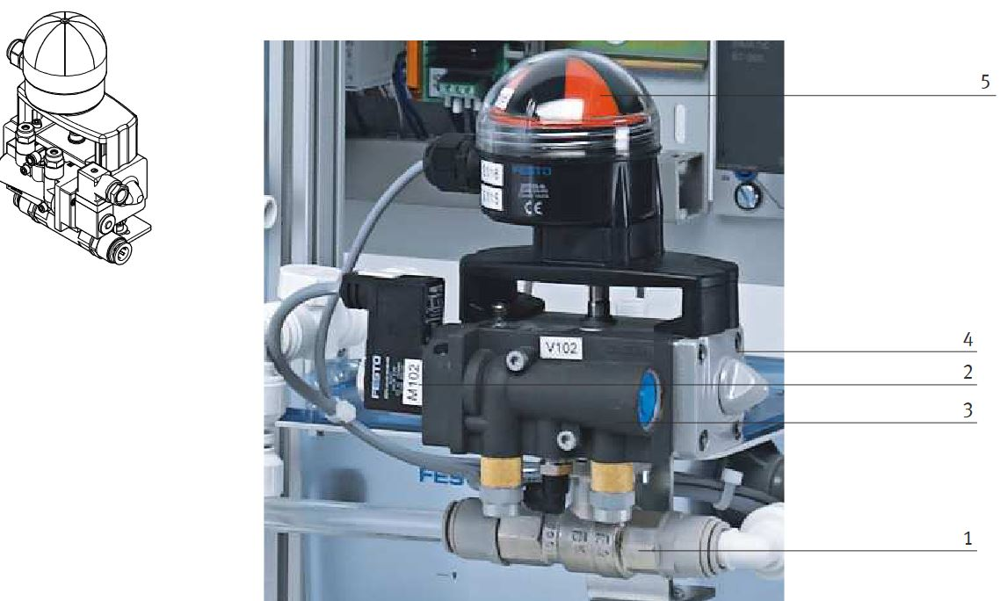
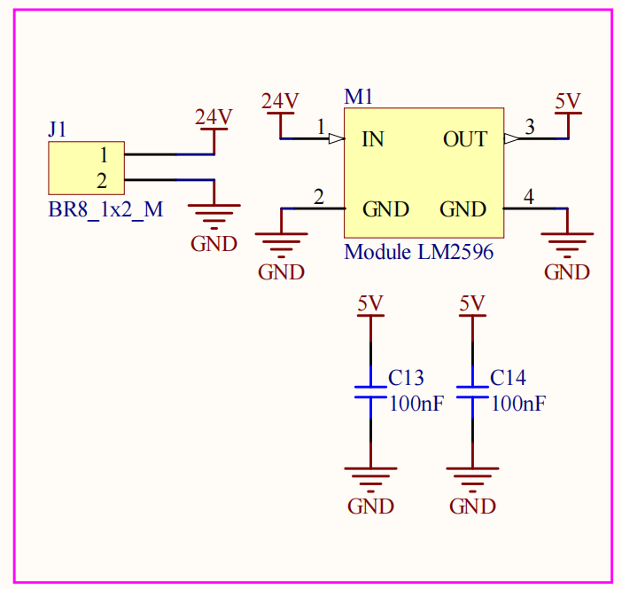
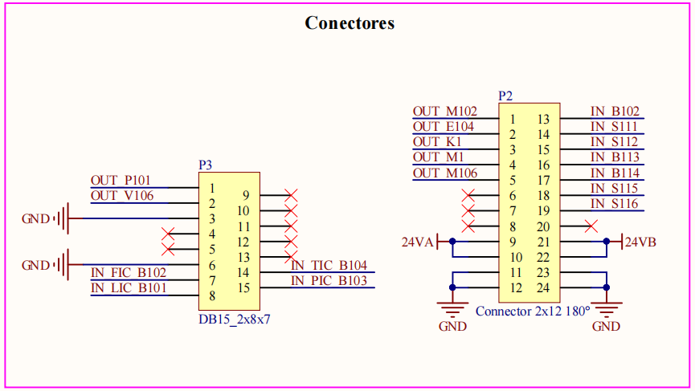
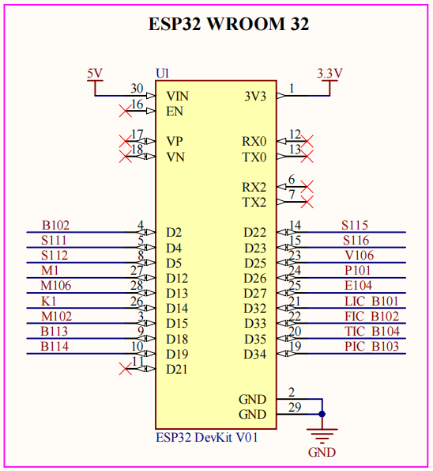
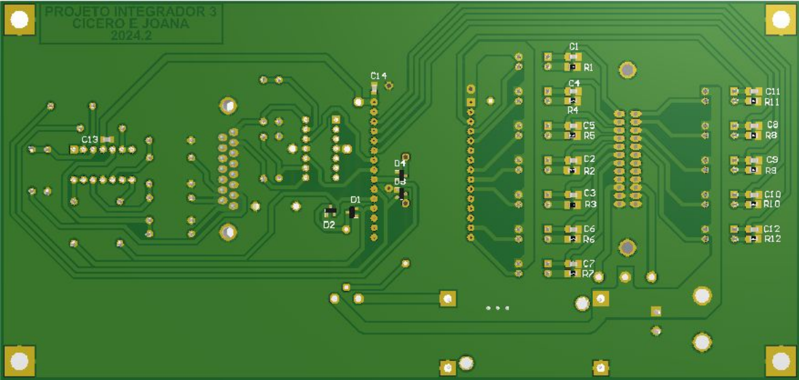
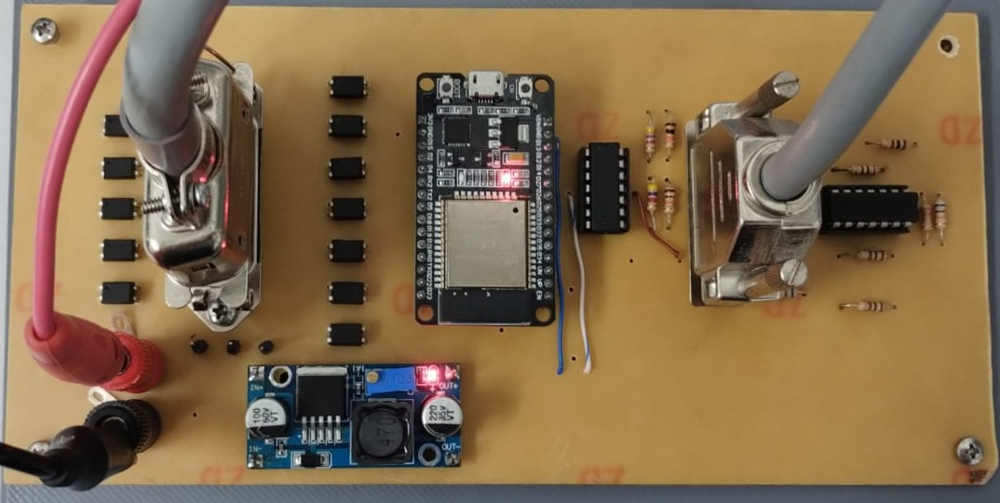

# PI3-2024-2
Repositório destinado ao Projeto Integrador 3 de Engenharia Eletrônica 

Desenvolvimento de uma interface microcontrolada para a bancada MPS PA Compact Workstation

## Etapa 1: 

### Introdução sobre a bancada MPS PA Compact Workstation

A **MPS PA Compact Workstation**, desenvolvida pela **Festo**, é uma plataforma de treinamento didático projetada para fins educacionais no campo da automação de processos. É um sistema versátil e compacto que facilita o treinamento industrial ao oferecer experiência prática com vários circuitos de controle, incluindo **nível**, **fluxo**, **pressão** e **temperatura**. Esta estação de trabalho permite que os alunos se envolvam com cenários de automação do mundo real, incluindo sistemas de controle de **circuito aberto** e **fechado**.

Um recurso interessante para o estudo é seu suporte para **controle em cascata**, uma estratégia que aprimora a estabilidade e a precisão do controle, especialmente no gerenciamento de sistemas complexos, como controles de nível e fluxo. A plataforma é equipada com diversos sensores e atuadores, como sensores capacitivos, medidores de fluxo magnético-indutivos e reguladores de pressão, proporcionando um aprendizado prático em automação e controle de processos.

O objetivo do projeto é desenvolver uma interface baseada em **microcontroladores** para a bancada com o intuito de aumentar a **flexibilidade** e a **autonomia** do sistema, permitindo maior integração com sistemas de controle personalizados e facilitando a interação de conhecimentos em sistemas de controle e microcontroladores, tornando a aplicação mais prática e personalizável.

Microcontroladores, como o **STM32** ou **ESP32**, podem ser usados para criar uma interface que se comunique diretamente com os sensores e atuadores da bancada, controlando variáveis como **temperatura**, **pressão** e **fluxo**. Isso possibilita a implementação de **protocolos de comunicação modernos** e o desenvolvimento de **interfaces gráficas** mais acessíveis, melhorando o desempenho e facilitando a integração com outros sistemas industriais ou acadêmicos.

---
### Características do ESP32 e Justificativa para sua Escolha

O **ESP32** é um microcontrolador altamente integrado, desenvolvido pela Espressif, que se destaca por suas diversas funcionalidades e desempenho em projetos de automação e controle. Uma das principais vantagens é seu excelente custo-benefício. Com um preço acessível, ele oferece uma ampla gama de recursos que competem com microcontroladores de maior custo. Isso o torna ideal para projetos acadêmicos e comerciais, onde a otimização de recursos financeiros é fundamental.

O ESP32 possui um potente processador dual-core que opera a até 240 MHz, proporcionando um desempenho significativo para tarefas complexas. Essa capacidade de processamento é especialmente útil em aplicações que exigem multitarefas, como o controle de diversos sensores e atuadores simultaneamente. Além disso, o ESP32 conta com uma quantidade considerável de memória RAM e flash, permitindo o desenvolvimento de aplicações mais robustas.

Outro ponto crucial para a escolha do ESP32 é sua conectividade Wi-Fi integrada. Essa funcionalidade permite a comunicação sem fio com outros dispositivos e a internet, facilitando a implementação de projetos de IoT (Internet das Coisas). A capacidade de se conectar facilmente a redes Wi-Fi torna o ESP32 uma escolha popular para aplicações que requerem monitoramento e controle remoto, além de possibilitar a troca de dados entre dispositivos.

A Espressif fornece um ambiente de desenvolvimento integrado (IDE) que facilita o aprendizado e a implementação de projetos com o ESP32. Com uma interface intuitiva e uma vasta documentação, o desenvolvimento do sistema pode rapidamente se tornar familiar com a programação e as funcionalidades do microcontrolador.

Diante dessas características, o ESP32 se destaca como uma excelente escolha para projetos que exigem um microcontrolador eficiente e versátil. Sua combinação de custo-benefício, poder de processamento, conectividade Wi-Fi e um ambiente de desenvolvimento amigável torna-o ideal para essa aplicação de automação e controle, além de promover o aprendizado prático em sistemas de IoT.

---
### Mapeamento dos Sensores e Atuadores presentes na bancada Festo - MPS PA Compact Workstation

A bancada Festo, objeto de estudo do nosso projeto, trabalha com uma série de sensores e atuadores, os quais descrevemos brevemente o funcionamento de cada um mais abaixo.

### Lista de Sensores
- **Sensor de nível ultrassônico** - B101
- **Sensores capacitivo de proximidade** - B113 / B114
- **Interruptores de nível tipo boia** - S111 / S112 / S117
- **Sensor de vazão** - B102
- **Sensor de pressão** - B103
- **Sensor de temperatura** - B104

### Lista de Atuadores
- **Bomba centrífuga** - P101
- **Válvula proporcional para controle de vazão** - V106
- **Válvula esférica** - V102
- **Aquecedor** - E104

Após entendermos o funcionamento de cada componente, precisamos mapear a comunicação entre os sensores e a interface da bancada, para podermos modelar nosso próprio circuito de interface com a ESP32. Verificamos que a bancada utiliza dois terminais distintos para comunicação analógica e digital. Dessa forma, mapeamos as conexões dos sensores e atuadores aos terminais para replicá-las em nosso projeto.

### Tabelas de Mapeamento
- **Terminal I/O Digital** - XMA1
- **Terminal I/O Analógico** - X2
---

### Sensores

| Descrição                            | Referência Datasheet |
|--------------------------------------|----------------------|
| Sensor de nível ultrassônico         | B101                 |
| Sensores capacitivo de proximidade   | B113 / B114          |
| Interruptores de nível tipo boia     | S111 / S112          |
| Sensor de vazão                      | B102                 |
| Sensor de pressão                    | B103                 |
| Sensor de temperatura                | B104                 |

### Sensor de nível ultrassônico - B101

O sinal de corrente analógico (4 ... 20 mA) do sensor ultrassônico(1) está conectado como um sinal padrão ao terminal analógico X2 (IE1) no canal 0. O sinal de corrente também está conectado ao transformador de medição A1, que converte o sinal de corrente analógico em um sinal de tensão padrão (0 ... 10 V). O sinal de tensão padrão também está conectado ao terminal analógico X2 (UE1).

### Sensores capacitivo de proximidade - B113 / B114

Dois interruptores de proximidade capacitivos, B113 (1) e B114 (2), estão localizados na lateral do tanque inferior B101 e montados em uma placa de perfil. Os interruptores de proximidade podem ser ajustados mecanicamente. A distância de detecção através da parede do tanque pode ser ajustada com um parafuso. Os sinais de entrada binários de 24 V são conectados ao terminal de E/S XMA1.

### Interruptores de nível tipo boia - S111 / S112 / S117

- **S111**: O transbordamento no tanque B101 é monitorado com o interruptor de boia. Se o nível no tanque exceder o nível máximo, o cilindro de boia transparente é empurrado para cima, ativando um contato reed. Os sinais de entrada binários de 24 V (normalmente abertos) são conectados ao terminal de E/S XMA1.
- **S112**: Monitora o nível mínimo no tanque superior B102. Os sinais de entrada binários de 24 V (normalmente fechados) são conectados ao terminal de E/S XMA1.
- **S117**: Monitora a diminuição do nível de enchimento do tanque B101, evitando que o aquecimento continue caso o nível fique abaixo do ponto crítico. O cabo do interruptor está conectado diretamente ao aquecimento.

### Sensor de vazão - B102

Um sinal de onda quadrada constante do sensor de vazão está conectado a uma entrada binária no terminal de E/S XMA1 (I0). O nível do sinal depende da tensão de alimentação aplicada (8...24 V). O sinal de frequência também está conectado ao transformador de medição A2, que converte o sinal em uma tensão padrão de 0 a 10 V.

### Sensor de pressão - B103

O sensor de pressão(2) piezoresistivo envia um sinal analógico de 0 a 10V de acordo com a pressão no tanque B103 entre 0 a 400mbar.

### Sensor de temperatura - B104

A resistência do sensor de temperatura(2) está conectada ao transformador de medição A3, que converte a resistência em um sinal de tensão padrão (0 a 10 V), conectado ao terminal analógico X2 (UE4). O aquecimento é controlado por um relé interno, ativado por uma saída digital (O1 no XMA1).

---

### Atuadores

| Descrição                                  | Referência Datasheet |
|--------------------------------------------|----------------------|
| Bomba centrífuga                           | P101                 |
| Válvula proporcional para controle de vazão| V106                 |
| Válvula esférica                           | V102                 |
| Aquecedor                                  | E104                 |

### Bomba centrífuga - P101

A bomba(1) é acionada pelo controlador de motor A4 e pelo relé K1. Com uma saída digital (O2 no XMA1), é possível alternar entre controle binário e controle analógico (0 a 24 V). No controle binário, a bomba é ligada/desligada com uma saída adicional (O3 no XMA1). No controle analógico, a tensão de acionamento define a velocidade da bomba (0 a 10 V).

### Válvula proporcional para controle de vazão - V106

A eletrônica de controle da válvula é ativada com uma saída binária (O4 no XMA1). Um sinal analógico do canal 1 (UA2 no X2) aciona a válvula com um sinal padrão de 0 a 10 V.

### Válvula esférica - V102

O acessório de detecção de posição final é composto por dois micro relés elétricos. Os sinais binários de 24 VDC (S115 e S116) estão conectados como entradas no terminal de E/S XMA1.

### Aquecedor - E104

O aquecimento é controlado internamente pela bancada, ativado por uma saída binária (O1 no XMA1). O controle do aquecimento pode ser binário ou contínuo (modulação por largura de pulso - PWM).

---

### Tabelas de Mapeamento

### Terminal I/O Digital

A bancada utiliza um terminal I/O digital, identificado como XMA1, para comunicação entre os sensores de saída binária com sua interface. 

Este terminal I/O possui uma conexão de 24 pinos padrão IEEE-488 a qual podemos utilizar em nosso benefício para comunicação entre nosso microcontrolador e a bancada.

Dessa forma, utilizando as informações encontradas no datasheet da bancada e seu diagrama elétrico fizemos o mapeamento de cada sensor e sua respectiva posição no terminal. Apresentados nas tabelas abaixo, divididos entre sensores e atuadores.

O terminal I/O digital trabalha com uma tensão de 24V, a qual precisaremos adequar para trabalhar com nosso microcontrolador que trabalha com tensão de 3.3V.

### Tabela 3 - Entradas e Saídas Digitais XMA1

| Descrição                                | Símbolo | Referência | Pino Terminal |
|------------------------------------------|---------|------------|---------------|
| Acionamento válvula esférica             | M102    | O0         | XMA1.1        |
| Aquecedor                                | E104    | O1         | XMA1.2        |
| Relé controle analógico da bomba         | K1      | O2         | XMA1.3        |
| Relé controle binário da bomba           | M1      | O3         | XMA1.4        |
| Acionamento válvula proporcional         | M106    | O4         | XMA1.5        |
| N/A                                      | N/A     | O5         | XMA1.6        |
| N/A                                      | N/A     | O6         | XMA1.7        |
| N/A                                      | N/A     | O7         | XMA1.8        |
| N/A                                      | 24V A   | 24V        | XMA1.9        |
| N/A                                      | 24V A   | 24V        | XMA1.10       | 
| N/A                                      | GND A   | GND        | XMA1.11       |
| N/A                                      | GND A   | GND        | XMA1.12       |
| Sensor de vazão                          | B102    | I0         | XMA1.13       |
| Interruptor de nível tipo boia           | S111    | I1         | XMA1.14       |
| Interruptor de nível tipo boia           | S112    | I2         | XMA1.15       |
| Sensor capacitivo de proximidade         | B113    | I3         | XMA1.16       |
| Sensor capacitivo de proximidade         | B114    | I4         | XMA1.17       |
| Micro relé para válvula esférica (V102)  | S115    | I5         | XMA1.18       |
| Micro relé para válvula esférica (V102)  | S116    | I6         | XMA1.19       |
| N/A                                      | N/A     | I7         | XMA1.20       |
| N/A                                      | 24V B   | 24V        | XMA1.21       |
| N/A                                      | 24V B   | 24V        | XMA1.22       |
| N/A                                      | GND B   | GND        | XMA1.23       |
| N/A                                      | GND B   | GND        | XMA1.24       |

### Terminal I/O Analógico

Os componentes analógicos da bancada também estão conectados a um terminal I/O, identificado como X2, para facilitar a integração e comunicação. Todos os sinais são convertidos para níveis de tensão entre 0 e 10V, os quais teremos que adequar para leitura nos conversores analógico-digitais de nosso microcontrolador.

Este terminal utiliza um conector D-Sub 15 pinos para comunicação com a interface, o qual utilizaremos em nosso benefício para conexão de nossa interface. Para isso, mapeamos os pinos do terminal e suas funções de controle dos componentes da bancada, conforme apresentado abaixo:

### Tabela 4 - Entradas Analógicas X2

| Descrição                                   | Símbolo | Atribuição de pinos | Referência |
|---------------------------------------------|---------|---------------------|------------|
| Bomba centrífuga                            | P101    | UA1                 | X2.1       |
| Válvula proporcional para controle de vazão | V106    | UA2                 | X2.2       |
| N/A                                         | N/A     | GND A               | X2.3       |
| N/A                                         | N/A     | IE2                 | X2.4       |
| N/A                                         | N/A     | IE1                 | X2.5       |
| N/A                                         | N/A     | GND B               | X2.6       |
| Sensor de vazão                             | FIC B102| UE2                 | X2.7       |
| Sensor de nível ultrassônico                | LIC B101| UE1                 | X2.8       |
| N/A                                         | N/A     | IA2                 | X2.9       |
| N/A                                         | N/A     | IA1                 | X2.10      |
| N/A                                         | N/A     | N.C.                | X2.11      |
| N/A                                         | N/A     | IE4                 | X2.12      |
| N/A                                         | N/A     | IE3                 | X2.13      |
| Sensor de temperatura                       | TIC B104| UE4                 | X2.14      |
| Sensor de pressão                           | PIC B103| UE3                 | X2.15      |

## Etapa 2

### Fluxograma do Sistema

O fluxograma apresentado abaixo descreve o processo de funcionamento da interface microcontrolada para a bancada MPS Festo com comunicação via Wi-Fi. Esse sistema visa gerenciar a comunicação e o controle de dispositivos da bancada de forma eficiente e prática.

**Início**: O sistema é inicializado. Nesta fase, o ESP32 é ligado e começa a executar o código que controla o processo.

**Conecta Wi-Fi**: O próximo passo é estabelecer uma conexão Wi-Fi. Essa conexão é essencial, pois será utilizada para a comunicação remota entre o microcontrolador e o sistema de controle, permitindo o monitoramento e o envio de comandos para a bancada.

**Inicia Servidor WEB**: Após a conexão com a rede Wi-Fi, o sistema inicia um servidor web. Esse servidor permite que dispositivos externos acessem e controlem a bancada por meio de uma interface web, onde será possível enviar comandos e receber dados sobre as variáveis do processo, como temperatura, pressão e fluxo.

**Configura Periféricos (ADC, Timers, GPIO)**: Nesta etapa, o microcontrolador configura os periféricos necessários, incluindo o conversor analógico-digital (ADC) para leitura de sensores, temporizadores para o controle de tarefas periódicas e os pinos de entrada/saída digital (GPIO) para o controle de atuadores e leitura de sensores digitais.

**Requisição de Dados?**: Uma vez que o sistema está configurado e em operação, ele monitora constantemente se há uma requisição de dados. Esse ponto de decisão verifica se o sistema recebeu uma solicitação de dados de algum dispositivo externo.
Caso não haja uma requisição de dados, o sistema retorna para o estado de espera, aguardando novas solicitações. Se houver uma requisição, o sistema processa o pedido.

**Retorna Dado**: Se uma requisição é identificada, o microcontrolador processa as informações solicitadas (como leituras de sensores ou estados dos atuadores) e as envia de volta ao dispositivo solicitante via servidor web, permitindo o monitoramento remoto em tempo real.

Esse fluxograma representa um sistema para o controle remoto da bancada MPS Festo usando um microcontrolador com conectividade Wi-Fi. O processo garante que o usuário consiga acessar e controlar a bancada remotamente, monitorando e ajustando os parâmetros em tempo real por meio de uma interface web. A interface microcontrolada desenvolvida com esse fluxograma proporciona uma flexibilidade e autonomia para o gerenciamento dos processos na bancada, além de melhorar a integração com sistemas de controle personalizados.

### Circuito de Interface ESP32 / Bancada

Visamos modelar circuitos simples e eficientes do ponto de vista energético para a comunicação. Para adequar os níveis de tensão de 24V para comunicação digital, utilizamos circuitos de chaveamento com optoacopladores: 

Para as saídas analógicas utilizamos amplificadores operacionais na topologia não-inversora para conversão do sinal de 3.3V para 10V. Para as entradas analógicas utilizamos um divisor resistivo juntamente com um circuito para proteção da ESP32 utilizando diodos e um amplificador operacional como seguidor de tensão.

## Etapa 3

### Esquemático do Circuito de Interface ESP32/Bancada
Após modelar e testar os circuitos, concluímos o primeiro protótipo de esquemático para nosso projeto, como segue abaixo:

Para a parte de alimentação vamos utilizar um módulo pronto do LM2596.

Para a ligação elétrica dos sensorres e atuadores com a nossa placa, utilizaremos os chicotes que já estão prontos na bancada e colocaremos os conectores para esses chicotes na placa.

Lista das entradas e saídas para organização do esquemático.

Circuito de entradas digitais.

Circuito de saídas digitais.

Circuito de entradas analógicas, nesse circuito, utilizamos dois diodos grampeadores para o caso do AmpOp mandar 24V para a saída e queimar o pino do microcontrolador.

Circuito de saídas analógicas.

Circuito de ligação da ESP32.

Os componentes utilizados estão listados na tabela abaixo:

| #  | Designator                                                      | Description                                                 | Quantity | Footprint                          |
|----|-----------------------------------------------------------------|-------------------------------------------------------------|----------|------------------------------------|
| 1  | C13, C14                                                        | CAP CER 100nF 50V X7R 0805                                  | 2        | 0805C                              |
| 2  | C1, C2, C3, C4, C5, C6, C7, C8, C9, C10, C11, C12               | CAP CER 10nF 50V X7R 0805                                   | 12       | 0805C                              |
| 3  | R1, R2, R3, R4, R5, R6, R7, R8, R9, R10, R11, R12               | RES 10K OHM 5% 1/8W 0805                                    | 12       | 0805R                              |
| 4  | J1                                                              | BR8 Metaltex connector, 1x2, male, 180°                     | 1        | BR8_1X2_M                          |
| 5  | IC3, IC4, IC5, IC6, IC7, IC8, IC9, IC10, IC11, IC12, IC13, IC14 | Integrated Circuit PC817C                                   | 12       | DIP762W60P254L458H450Q4N           |     
| 6  | IC1, IC2                                                        | Integrated Circuit LM324N/NOPB                              | 2        | DIP794W56P254L1905H533Q14N         |
| 7  | P3                                                              | Connector DB15 female, 180º, 2 Lines, 7e8 Columns, 26 Pins  | 1        | ds1033                             |
| 8  | P2                                                              | Connector DS1078 Female, 180°, 2 Lines, 12 Columns, 24 Pins | 1        | ds1039                             |
| 9  | U1                                                              | IC MCU 32BIT ESP32 DEVKIT V01                               | 1        | ESP32-DEVKIT-V1                    |
| 10 | M1                                                              | LM2596 4 Pins                                               | 1        | MOD_LM2596                         |
| 11 | R26, R27, R35, R36                                              | RES 100 OHM 5% 1/8W                                         | 4        | RESISTOR                           |
| 12 | R25, R40                                                        | RES 10k OHM 5% 1/8W                                         | 2        | RESISTOR                           |
| 13 | R33, R34, R38, R39                                              | RES 33K OHM 5% 1/8W                                         | 4        | RESISTOR                           |
| 14 | R28, R37                                                        | RES 4K7 OHM 5% 1/8W                                         | 2        | RESISTOR                           |
| 15 | R29, R30, R31, R32                                              | RES 68K OHM 5% 1/8W                                         | 4        | RESISTOR                           |
| 16 | D1, D2, D3, D4                                                  | Schottky Diode                                              | 4        | SOT95P230X110-3N                   |

A PCB foi roteada pelo Bottom Layer, os componentes PTH foram posicionados do lado do Top Layer, a placa ficou com aproximadamente 21 x 10 cm. O resultado final do roteamento da placa é mostrado a seguir:

## Etapa 4

Antes de fabricar a PCB, realizamos testes em bancada utilizando uma placa de prototipagem ilhada. Nela, simulamos cada tipo de circuito digital e analógico, tanto de entrada quanto de saída, para validar o funcionamento do circuito eletrônico proposto.

Com esse teste, verificamos que o resistor de 10 kΩ presente na entrada do optoacoplador no circuito digital de acionamento (como mostrado na imagem abaixo) não fornecia corrente suficiente para polarizar o transistor na saída do optoacoplador, o que limitava a tensão de saída. Para a produção da placa, substituímos esse resistor por um de 1 kΩ

A placa foi desenvolvida no laboratório de protótipos(LPDE) do IFSC pelo método de transferência por toner. O circuito desenvolvido no Altium foi impresso em papel glossy com uma impressora a laser. A placa de fenolite foi cortada no tamanho desejado e sua superfície de cobre foi limpa com lixa fina e álcool isopropílico. Em seguida, o papel impresso foi posicionado sobre a placa e submetido a calor e pressão por meio de um ferro de passar roupa, garantindo a transferência do toner para o cobre. Após o resfriamento, a placa foi imersa em água morna para remoção do papel, revelando as trilhas de toner aderidas. O próximo passo foi utilizar percloreto de ferro para corroer as áreas de cobre não protegidas. Concluída a corrosão, o toner foi removido com álcool isopropílico, deixando apenas as trilhas condutoras. Para finalizar, foram realizados os furos para conexão dos componentes e aplicado um verniz protetor. O processo resultou em uma PCB funcional, com algumas trilhas apresentando falhas devido à pressão e temperatura da transferência, indicando a necessidade de ajustes para otimização da qualidade final.

A placa foi conectada à bancada (conforme ilustrado na figura abaixo) para verificar seu funcionamento e realizar os testes necessários para validação.

Para integrar a placa desenvolvida à bancada, optamos por projetar um suporte 3D em vez de um gabinete, visando facilitar o acesso aos conectores e componentes. Essa escolha permite maior flexibilidade para testes e medições com multímetro, alinhando-se à natureza didática da bancada.
O suporte foi projetado com 22 cm de largura e 17,5 cm de altura, para ser encaixado entre as esteiras presentes na estrutura da bancada.

A placa fixada junto a bancada é mostrada na figura abaixo.

### Descrição geral do funcionamento

Ao energizar o sistema, o ESP32 inicia um access point com o nome de rede (ESP32_AP) e a senha configurados no código. Após conectar um dispositivo a esse access point, o usuário deve acessar o IP do ESP32 (192.168.4.1) por meio de um navegador web. Dessa forma, a interface será exibida, conforme ilustrado na imagem a seguir, apresentando todas as informações dos sensores e atuadores digitais e analógicos. Na interface do sistema, o usuário poderá interagir com os atuadores digitais, controlar os acionadores analógicos e monitorar os sensores em tempo real.

O firmware da interface está descrito de forma mais detalhada em um arquivo que pode ser acessado pelo link: [Descrição do Firmware](/firmware/README.md)

### Conclusão dos testes realizados

Mesmo após substituir o resistor na entrada do optoacoplador no circuito digital de acionamento por um de 1 kΩ, a corrente ainda não foi suficiente para polarizar o transistor. Para corrigir essa limitação, realizamos uma nova troca, reduzindo os resistores para 330 Ω, o que permitiu o acionamento da bomba de água (M1).

Para uma análise mais detalhada, testamos o circuito digital aplicando uma tensão direta de 24V e, utilizando um multímetro no modo amperímetro, medimos a corrente necessária para o acionamento de cada componente. Os valores obtidos foram: M106 requer 18 mA, E104 requer 9,6 mA, M102 requer 200 mA, M1 requer 10,8 mA e K1 requer 26 mA. Com base nesses resultados, concluímos que o acionamento da válvula esférica (M102) ultrapassa o limite de corrente suportado pelo optoacoplador, que, conforme o datasheet, é de 50 mA Dessa forma, não é possível acionar a válvula com a configuração atual do circuito eletrônico, sendo necessária a adoção de uma nova estratégia. Para o acionamento da válvula proporcional (M106) e do relé de controle analógico da bomba (K1), é necessário avaliar a substituição dos resistores de entrada do optoacoplador por valores menores e validar se essa alteração permite o acionamento correto.

O circuito de entradas digitais foi testado por meio da simulação do manuseio de alguns sensores, permitindo o monitoramento do seu comportamento pela interface web do sistema. Os testes confirmaram que o circuito projetado apresentou o desempenho esperado.

O circuito de entradas e saídas analógicas atendeu corretamente aos requisitos do projeto, apresentando resultados condizentes com as especificações definidas no projeto inicial.
